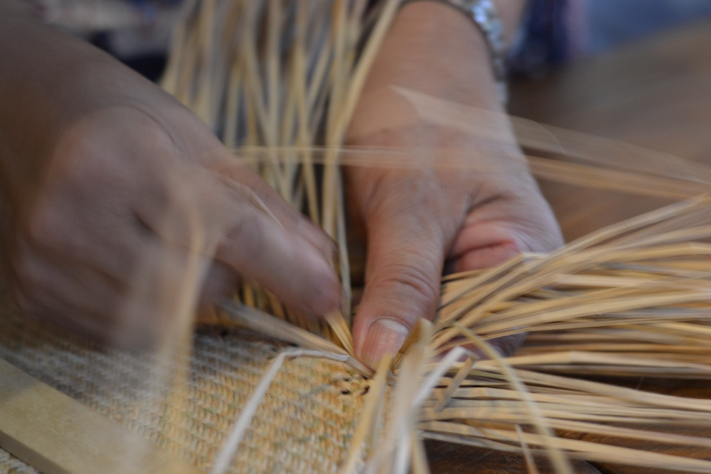
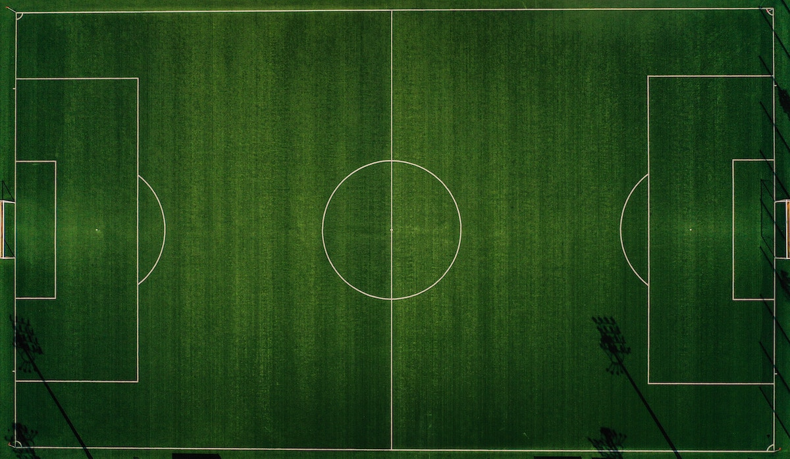

```{r setup, include=FALSE}
usethis::use_git_ignore(c("*.csv", "*.rds"))
options(htmltools.dir.version = FALSE)

library(knitr)
library(tidyverse)
library(xaringan)
library(fontawesome)
```

class: inverse, center, middle

# `r fa("fas fa-images", fill = "#fff")`

**View the slides:** 

[bretsw.com/eme6665-ss23-module7](https://bretsw.com/eme6665-ss23-module7)

---

class: inverse, center, middle

# `r fa("fas fa-share-nodes", fill = "#fff")` <br><br> Module 7 <br> Weaving Together Chapter One

---

# `r fa("fas fa-share-nodes", fill = "#fff")` Structure

```{r, out.width = "720px%", echo = FALSE, fig.align = "center"}
include_graphics("img/frame.jpg")
```

Your problem (introduction) and framework sections can help to **provide structure** to your lit review

---

# `r fa("fas fa-share-nodes", fill = "#fff")` Bridge

```{r, out.width = "720px", echo = FALSE, fig.align = "center"}

```

Your lit review is a **bridge between** the problem (introduction) and your research questions

---

class: inverse, center, middle

# `r fa("fas fa-binoculars", fill = "#fff")` <br><br> Looking ahead

---

# `r fa("fas fa-calendar-day", fill = "#fff")` Semester schedule

- Module 1: Threads of Chapter One

- Module 2: Do You Trust Me?

- Module 3: A Handbook's Tale

- Module 4: Systematic Not Automatic

- Module 5: Synthesis Over Summary

- Module 6: Elements of Style (for Academic Writing)

- **Module 7: Weaving Together Chapter One**

---

# `r fa("fas fa-calendar-day", fill = "#fff")` Final Assignment

```{r, out.width = "240px", echo = FALSE, fig.align = "center"}

```

--

**Objective:** Compile previously identified and evaluated research to compose a **complete** and **coherent** dissertation literature review.

--

Chapter one pulls together an introduction, the literature review, a framework, and research questions.

--

<hr>

--

- `r fa("fas fa-pen", fill = "#782f40")` **Introduction**

--

  - Research topic

--

  - Problem

--

  - Purpose

---

# `r fa("fas fa-calendar-day", fill = "#fff")` Final Assignment

```{r, out.width = "240px", echo = FALSE, fig.align = "center"}

```

--

**Objective:** Compile previously identified and evaluated research to compose a **complete** and **coherent** dissertation literature review.

Chapter one pulls together an introduction, the literature review, a framework, and research questions.

<hr>

- `r fa("fas fa-pen", fill = "#782f40")` **Literature Review**

--

- `r fa("fas fa-pen", fill = "#782f40")` **Framework**

--

- `r fa("fas fa-pen", fill = "#782f40")` **Research Questions**

---

# `r fa("fas fa-calendar-day", fill = "#fff")` Final Assignment

```{r, out.width = "240px", echo = FALSE, fig.align = "center"}

```

- `r fa("fas fa-pen", fill = "#782f40")` **Key elements**

--

  - Synthesis of past research

--

  - Significance of past research

--

  - An argument

--

  - Alignment and focus

--

  - Narrative flow

---

# `r fa("fas fa-calendar-day", fill = "#fff")` Final Assignment

```{r, out.width = "240px", echo = FALSE, fig.align = "center"}

```

**Objective:** Compile previously identified and evaluated research to compose a **complete** and **coherent** dissertation literature review.

--

<hr>

- `r fa("fas fa-pen", fill = "#782f40")` **Introduction**

- `r fa("fas fa-pen", fill = "#782f40")` **Literature Review**

- `r fa("fas fa-pen", fill = "#782f40")` **Framework**

- `r fa("fas fa-pen", fill = "#782f40")` **Purpose & Research Questions**

---

# `r fa("fas fa-share-nodes", fill = "#fff")` Order: Soccer Formations

```{r, out.width = "540px", echo = FALSE, fig.align = "center"}

```

--

- `r fa("fas fa-pen", fill = "#782f40")` Introduction + Literature Review + Framework + Purpose & Research Questions

--

- `r fa("fas fa-pen", fill = "#782f40")` Introduction + Framework + Literature Review + Purpose & Research Questions

--

- `r fa("fas fa-pen", fill = "#782f40")` Introduction + Framework + Purpose & Research Questions + Literature Review

---

class: inverse, center, middle

# `r fa("fas fa-thumbtack", fill = "#fff")` <br><br> Synthesis Practice

---

class: inverse, center, middle

# `r fa("fas fa-thumbtack", fill = "#fff")` Synthesis Practice 1

<div class="padlet-embed" style="border:1px solid rgba(0,0,0,0.1);border-radius:2px;box-sizing:border-box;overflow:hidden;position:relative;width:100%;background:#F4F4F4"><p style="padding:0;margin:0"><iframe src="https://fsu.padlet.org/embed/rhdnd3t5tuwj3q8f" frameborder="0" allow="camera;microphone;geolocation" style="width:100%;height:480px;display:block;padding:0;margin:0"></iframe></p><div style="display:flex;align-items:center;justify-content:end;margin:0;height:28px"><a href="https://padlet.com?ref=embed" style="display:block;flex-grow:0;margin:0;border:none;padding:0;text-decoration:none" target="_blank"><div style="display:flex;align-items:center;"></div></a></div></div>

---

class: inverse, center, middle

# `r fa("fas fa-thumbtack", fill = "#fff")` Synthesis Practice 2

<div class="padlet-embed" style="border:1px solid rgba(0,0,0,0.1);border-radius:2px;box-sizing:border-box;overflow:hidden;position:relative;width:100%;background:#F4F4F4"><p style="padding:0;margin:0"><iframe src="https://fsu.padlet.org/embed/aiz37af9trwq7mcu" frameborder="0" allow="camera;microphone;geolocation" style="width:100%;height:480px;display:block;padding:0;margin:0"></iframe></p><div style="display:flex;align-items:center;justify-content:end;margin:0;height:28px"><a href="https://padlet.com?ref=embed" style="display:block;flex-grow:0;margin:0;border:none;padding:0;text-decoration:none" target="_blank"><div style="display:flex;align-items:center;"></div></a></div></div>

---

class: inverse, center, middle

# `r fa("fas fa-question", fill = "#fff")` <br><br> Questions

<hr>

**What questions can I answer for you now?**

**How can I support you this week?**

<hr>

`r fa("envelope", fill = "#fff")` [bret.staudtwillet@fsu.edu](mailto:bret.staudtwillet@fsu.edu) | `r fa("globe", fill = "#fff")` [bretsw.com](https://bretsw.com) | `r fa("fab fa-github", fill = "#fff")` [GitHub](https://github.com/bretsw/)
